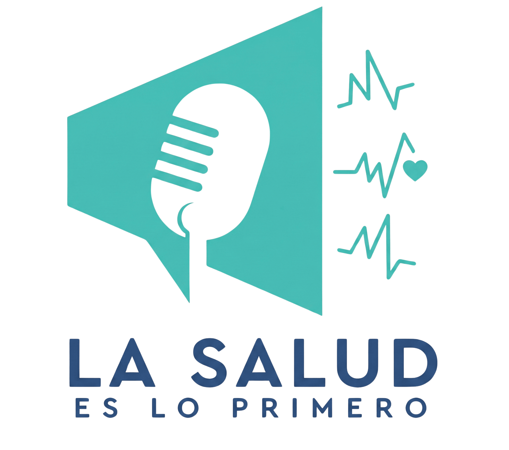

<h1>🎙️ Media Kit Digital: La Salud es lo 1ero</h1>

<em>Conecta tu marca con quienes toman las decisiones de salud en Aragua.</em>

<!-- Badges Tecnológicos -->

"La Salud es lo 1ero" es un programa de radio enfocado en medicina preventiva y divulgación científica, transmitido por Radio Boost Digital en Maracay, Aragua.

Este repositorio contiene el código fuente de la Landing Page (Media Kit B2B), diseñada estratégicamente para atraer y convertir a marcas del sector salud (clínicas, médicos especialistas, farmacias) en patrocinadores oficiales del programa.

🎯 Objetivo del Proyecto

Crear un embudo de ventas digital (Landing Page) que comunique de manera efectiva la propuesta de valor del programa a los directores de marketing y gerentes de clínicas. El enfoque principal es destacar la calidad y segmentación de la audiencia frente a la cantidad masiva de oyentes.

🚀 Características Principales

📱 Diseño Moderno y Responsivo: Interfaz adaptada a dispositivos móviles y de escritorio, utilizando una paleta de colores limpia (blanco, verde menta, azul marino y acentos naranjas).

✨ Animaciones de Scroll (Intersection Observer): Elementos visuales y contadores numéricos que se activan suavemente a medida que el usuario navega por la página, mejorando la experiencia de usuario (UX).

🔥 Gatillos Mentales (FOMO): Etiquetas de urgencia visuales en los paquetes de patrocinio para incentivar la rápida toma de decisiones.

❓ Sección de Preguntas Frecuentes (FAQ): Acordeón interactivo para resolver objeciones comunes de los potenciales patrocinadores antes de que contacten al equipo de ventas.

📧 Captación de Leads (Integración con EmailJS): Formulario "Lead Magnet" funcional que permite a los usuarios solicitar el Media Kit en PDF a cambio de sus datos comerciales, enviando notificaciones automáticas vía correo electrónico sin necesidad de un backend tradicional.

💬 Botón de WhatsApp Flotante: Acceso rápido y directo para iniciar una conversación comercial.

🛡️ Optimización y Seguridad: Implementación de cabeceras CSP, prevención XSS básica (sanitización de inputs) y optimización de carga de iframes de video.

🛠️ Stack Tecnológico

Este proyecto está construido con tecnologías web base (Vanilla), sin frameworks pesados, para garantizar máxima velocidad y simplicidad:

HTML5: Estructura semántica.

CSS3: Estilos personalizados, variables, Flexbox/Grid y animaciones por CSS.

JavaScript (ES6): Lógica de animaciones (Intersection Observer) y manejo del formulario.

EmailJS: Servicio de terceros para el envío de correos desde el frontend.

📝 Autores y Producción

Desarrollado para el equipo de "La Salud es lo 1ero".

🎙️ Locutoras: Lcda. Edit Piñero y Lcda. Marina Abreu.

📻 Producción: Radio Boost Digital (Maracay, Venezuela).

<em>Este proyecto está diseñado para la captación B2B y crecimiento comercial del programa.</em>

